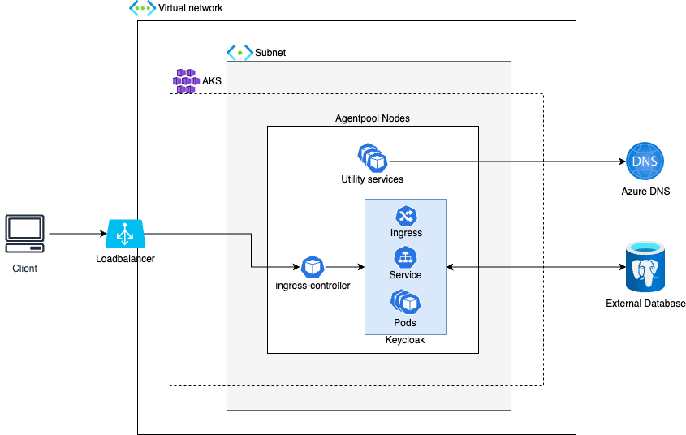

# Implement Keycloak HA Setup with External DB

* [Architecture](#architecture)
  * [Current state](#current-state)
  * [Further architecture improvements](#further-architecture-improvements)
* [Deployment](#deployment)
  * [Infrastructure provisioning](#infrastructure-provisioning)
  * [Kubernetes initialization](#kubernetes-initialization)
  * [Keycloak installation](#keycloak-installation)
  * [Service integration](#service-integration)
* [Operations](#operations)
  * [Maintenance](#maintenance)
    * [Connect to cluster](#connect-to-cluster)
    * [Backup & Restore](#backup--restore)
    * [Scaling](#scaling)
    * [Change Keycloak configuration](#change-keycloak-configuration)
    * [Update Keycloak version](#update-keycloak-version)
  * [Troubleshooting](#troubleshooting)
    * [Check application logs](#check-application-logs)
    * [Check node health](#check-node-health)
    * [Check pod health](#check-pod-health)
    * [Check overall cluster health](#check-overall-cluster-health)
    * [Check database health](#check-odatabase-health)
  * [Monitoring](#monitoring)
    * [Logs](#logs)
    * [Metrics](#metrics)
    * [Traces](#traces)
    * [Alerting](#alerting)

## Architecture

### Current state



The architecture is based on Azure Kubernetes Service (AKS) where the compute nodes are spread across availability zones. This allows Keycloak to be easily deployed in a high availability setup. In this case three instances of Keycloak are deployed across three nodes, sharing the same external database.

Access to Keycloak is facilitated via a load balancer which is automatically provisioned from within AKS.

Azure Database for PostgreSQL Flexible Server is used as external database for Keycloak and access is facilitated with username/password for simplicity.

Azure DNS is used to resolve hostnames.

Azure Key Vault is used to store the DB admin password.

### Further architecture improvements

>[!IMPORTANT]
>For a production grade setup at least the following aspects have to be considered and implemented from an infrastructure point of view:

* Do not use default virtual network and subnets.
* Ensure traffic is private and use e.g. a bastion host to connect to the network.
* Use Azure NAT Gateway for internet access (ipv4).
* Use Azure Keyvault to store secrets and use Azure Private Link to connect to it from AKS.
* Use Azure Container Registry and a pull-through cache to store and retrieve OCI artifacts like container images or helm charts to reduce external dependencies. Connect to it via Azure Private Link.
* Ensure encryption at rest and encryption in transit. This includes managing encryption keys and certificates.
* Use AKS system/agent node pool only for critical workload. Use dedicated user node pools for further workload. Node pools should be deployed to all availability zones.
* Use e.g. Kubernetes RBAC with Azure RBAC integration to manage cluster access.
* Automate the deployment of infrastructure and workload to ensure consistency (use CI/CD pipelines and GitOps approach).
* Use Azure Private Link or VNet Integration to facilitate private access between AKS and Azure Database for PostgreSQL Flexible Server.
* Use managed identities to for authn/authz form Kubernetes workload to Azure services.
* Consider deploying Azure Database for PostgreSQL Flexible Server in `ZoneRedundant` mode and add read replicas which can be promoted to primary instances in case of failures.
* Consider using a web application firewall (either within Kubernetes or as part of the load balancer).
* Consider FinOps best practices to ensure reasonable cloud spending. This includes aspects like rightsizing and autoscaling of e.g. compute, storage and application resources.

## Deployment
### Infrastructure provisioning
The infrastructure components are provisioned via Terraform with its state saved in Azure Blob Storage. To provision the initial infrastructure needed for the terraform backend one can run `sh ./infra/script/create-tf-backend.sh` from the root of the git repository. It is required to have Azure CLI (https://learn.microsoft.com/en-us/cli/azure/install-azure-cli) installed and to be logged in (`az login`).

Create a file called postgresql_password in `/infra/files/` and add a password. This will be written to Azure Key vault and used for the database deployment.

After that use `terraform init` to initialize your local environment. With `terraform plan` and `terraform apply` you can check which resources will be deployed and execute the deployment. After all resources are successfully deployed you can continue with [initializing Kubernetes](#kubernetes-initialization).

TODO: keyvault + DB password

### Kubernetes initialization
Install helm; run script

### Keycloak installation
TODO: describe helm deployment

Access URL + PW

### Service integration
TODO: describe how to enable a service to be used with keycloak

## Operations

The following sections include commands to be executed in the CLI. To ensure that these commands are successful please check the prerequisites:
* Azure CLI (https://learn.microsoft.com/en-us/cli/azure/install-azure-cli), kubectl (https://kubernetes.io/docs/tasks/tools/) and kubelogin (https://azure.github.io/kubelogin/install.html) are installed (https://learn.microsoft.com/en-us/cli/azure/install-azure-cli) on the machine that has access to the cluster. This can be a local machine if cluster has public access enabled (which is the case for the current infrastrucutre setup) or e.g. a bastion host if the cluster is private (should be private for production). To connect to the bastion host you can use the Azure portal (https://portal.azure.com/) to identify the VM and check the connection possibilities.


### Maintenance

#### Connect to cluster

To connect run the following commands (you can also find them in the Azure Portal via the "Connect" option in the overview tab of the respective Kubernetes cluster):
1. Login on the cli: `az login` (use the flag `--tenant <tenant_id>` if you have access to multiple tenants)
2. Set subscription where the cluster is deployed: `az account set --subscription <subscription_id>`
3. Retrieve access credentials: `az aks get-credentials --resource-group <cluster_resource_group> --name <cluster_name> --overwrite-existing`
4. Use kubelogin plugin for authentication: `kubelogin convert-kubeconfig -l azurecli`
5. Now you can use commands like `kubectl get nodes` to interact with the Kubernetes cluster.

#### Backup & Restore
**Kubernetes resources**  
All kubernetes manifests are stored in Git and deployed in a GitOps manner using **INSERT CICD TOOL HERE** and are automatically reconciled when there is a drift. This automatic reconciliation has to be disable before any maintenance task is performed to prevent data loss or data corruption.

**TODO: Add part about disabling reconciliation loop on CICD tool**

Keycloak can be scaled up/down (equivalent of starting/stopping keycloak) using kubectl as follows

```shell
# Stop the Keycloak instances
kubectl --namespace keycloak-system patch keycloak keycloak  --type=json --patch='[{"op":"replace","path":"/spec/instances","value":0}]'

# Perform maintenance tasks

# Start the Keycloak instances
kubectl --namespace keycloak-system patch keycloak keycloak  --type=json --patch='[{"op":"replace","path":"/spec/instances","value":3}]'
```

**Azure resources**

The database is the most crucial resource for Keycloak in a Kubernetes based environment as multiple Keycloak instances can be created/deleted with ease, however they all rely on a production ready database that can is performant and reliable. It should be periodically backed up and be available to be quickly restored in case of a disaster.

The Azure Database for PostgreSQL flexible server can be backed up in multiple ways. The restore steps depend on the type of backup that is used to restore the database. The following backup options are supported  
1. Automated daily backups as part of the Azure Database for PostgreSQL flexible server deployment (supports point in time restores only)
2. Configurable periodic backups as part of a Backup Policy created in an Azure Backup Vault (supports point in time restores and backup on demand)
3. On demand export/import of database using PostgreSQL tools pg_dump and pg_restore/psql. 

In case of Automated daily backups, restoring a database involves restoring from a snapshot. This creates a new Azure Database for PostgreSQL flexible server and the Keycloak deployment is simply pointed to the new server or DNS can be used to point to the new server.

In case of backups stored in an Azure Backup Vault, the restore process involves first restoring a specific backup from the Azure Backup Vault to an Azure Storage Account Container and then using PostgreSQL tools pg_restore/psql to restore the database.

The database at any point in time can be backed up and restored using PostgreSQL tools pg_dump and pg_restore/psql.

#### Scaling
Depending on the load on the system different parts can be scaled. Check the following.

##### Kubernetes
Either the number of nodes or the instance type can be scaled in [/infra/main.tf](./infra/main.tf). To scale the number of nodes in a node pool adjust the `node_count` property. The instance type can be changed with the `vm_size` property.

##### Database
Database settings can be adjusted via the `sku_name`, `storage_mb` and `storage_tier` parameters in [/infra/database.tf](./infra/database.tf).

##### Keycloak

To increase the number of Keycloak instances adjust the `replicas` factor in TODO:. The available resources (cpu/memory) can also be adjusted there. After that make sure to rollout the changes via TODO:. (Note: In a mature setup the horizontal and vertical scaling can be automated in Kubernetes. For automatic rollouts a GitOps tool would be used.)

#### Change Keycloak configuration

To change configuration parameters of Keycloak adjust the corresponding values in TODO: (Keycloak CRD) and rollout the changes via TODO:. (Note: In a mature setup the rollouts would be automated via a GitOps tool.)

Helm

To check that the Keycloak instance has been provisioned in the cluster run:

`kubectl get keycloaks/keycloak-full-coral -n keycloak-system -o go-template='{{range .status.conditions}}CONDITION: {{.type}}{{"\n"}}  STATUS: {{.status}}{{"\n"}}  MESSAGE: {{.message}}{{"\n"}}{{end}}'`

The output for the successful deployment should look like this: 

```sh
CONDITION: Ready
  STATUS: true
  MESSAGE:
CONDITION: HasErrors
  STATUS: false
  MESSAGE:
CONDITION: RollingUpdate
  STATUS: false
  MESSAGE:
```

#### Update Keycloak version

TODO:

Helm

Lifecycle management, downtimes???

#### Add/remove users/realms etc
TODO:

Not sure if we need this but either via direct UI import or via API calls (could be automated with custom script and TF). 

### Troubleshooting
>[!NOTE]
>
>To use the following kubectl commands prerequisite is that you are able to connect to the cluster (see [here](#connect-to-cluster)).
>
>In the kubectl commands you can also use `get -o yaml` instead of `describe` to get the configuration details of the individual Kubernetes resources.

#### Check application logs
You can directly access Keycloak application logs from Kubernetes. 

To see all Keycloak logs: `kubectl logs sts/keycloak-full-coral -n keycloak-system`

To see specific pod logs: `kubectl logs pod/<pod_name> -n <pod_namespace>`

#### Check Node health

* List nodes and their status: `kubectl get nodes`
* Describe Nodes that are not healthy and check `Events`: `kubectl describe node <node_name>`

#### Check Pod health

* List all Pods and check `Status`: `kubectl get pods -A`
* List all Keycloak Pods and check `Status`: `kubectl get pods -n keycloak-system`
* Describe Pods that are not healthy and check `Events`: `kubectl describe pod <pod_name> -n keycloak-system` (example is for Keycloak)
* Check logs of Pods that are not healthy

#### Check network path
You can use a bottom-up approach to identify issues along the network path. 

* Check if Keycloak Pods are healthy (see [here](#check-pod-health)) and fix potential issues
* Check if Keycloak Service points to backend Pods:
  * `kubectl describe svc keycloak-full-coral-service -n keycloak-system`
  * `Endpoints` should list the IPs and ports of the Keycloak Pods. If that is not the case then the Service is probably misconfigured (e.g. wrong selector or targetPorts).
* Check if Keycloak Ingress points to Service:
  * `kubectl describe ing keycloak-full-coral-ingress -n keycloak-system`
  * backend should point to the keycloak service
* Check if ingress controller is up and running: Follow the steps to check pod health (see [here](#check-pod-health)) but use `ingress-nginx` instead of `keycloak-system`
* If the previous steps didn't reveal issues you should check the load balancer in Azure, especially if the health probes are successful and if the kubernetes nodes are listed in the backend pool. Additionally you should also check if the DNS records are correctly configured.

#### Check overall cluster health
The following command will print very detailed information about the overall health of the cluster:

`kubectl cluster-info dump`

You can use the output to search for errors.

#### Check Database Health
Use a monitoring system or the Azure Portal to check if the database used by Keycloak is healthy. Take a look at the server metrics (e.g. failed connections, alive status) and if the database used by Keycloak exists.

### Monitoring


A proper monitoring solution includes an observability tool that consumes different signals like logs, metrics and traces from the whole system landscape (infrastructure and applications). This data needs to be visualized to quickly understand it and an alerting system needs to established which notifies incident response tools and notifies teams. 

#### Logs
The observability system should collect logs from Kubernetes workload including Keycloak and the utility services. To not consume too many logs (and therefore generate noise and unwanted costs) it is sufficient to focus on logs with a log level of warning and above. This is usually supported by log collectors. For access logs from the ingress controller this needs to be evaluated if `info` logs should also be consumed. 

Besides logs from Kubernetes it is also important to check infrastructure component logs e.g. from Azure Database for PostgreSQL Flexible Server and other system that might produce logs.

Audit logs should also be consumed to track potential unwanted configuration changes or access.

#### Metrics
Metrics from infrastructure and application resources should be monitored and proper alerting established. At least these metrics should be covered:

* CPU
* Memory
* Disk pressure
* DB connections
* DB latency
* Storage consumption
* Kubernetes Pod status
* Kuberentes Pod restarts
* Kubernetes Node status
* Keycloak usage metrics (e.g. login errors, registrations)

#### Traces
To get an end-to-end view on system performance a tracing solution should be established. This helps to quickly identify bottlenecks and points of failure. This can also help in scaling and right-sizing decisions.

#### Alerting
Based on the logs, metrics and tracing data a proper alerting should be established that allows for quick discovery of unexpected behavior. Depending on the priority of alerts incidents can be triggered in downstream tools like PagerDuty and/or communicated to responsible teams via Teams, Slack or alike.
