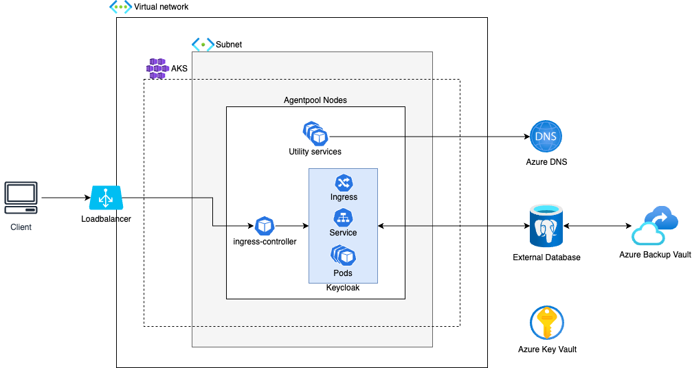

# Implement Keycloak HA Setup with External DB

## Architecture

### Current state

The architecture is based on Azure Kubernetes Service (AKS) where the compute nodes are spread across availability zones. This allows Keycloak to be easily deployed in a high availability setup.
Access to Keycloak is facilitated via a load balancer.

Azure Database for PostgreSQL Flexible Server is used as external database for Keycloak.

Azure DNS is used to resolve hostnames.

### Further architecture improvements

>[!IMPORTANT]
>For a production grade setup at least the following aspects have to be considered and implemented from an infrastructure point of view:
* Do not use default virtual network and subnets.
* Ensure traffic is private and use e.g. a bastion host to connect to the network.
* Use Azure NAT Gateway for internet access (ipv4).
* Use Azure Keyvault to store secrets and use Azure Private Link to connect to it from AKS.
* Use Azure Container Registry and a pull-through cache to store and retrieve OCI artifacts like container images or helm charts to reduce external dependencies. Connect to it via Azure Private Link.
* Ensure encryption at rest and encryption in transit. This includes managing encryption keys and certificates.
* Use AKS system/agent node pool only for critical workload. Use dedicated user node pools for further workload. Node pools should be deployed to all availability zones.
* Use e.g. Kubernetes RBAC with Azure RBAC integration to manage cluster access.
* Automate the deployment of infrastructure and workload to ensure consistency (use e.g. GitOps approach).
* Use Azure Private Link or VNet Integration to facilitate private access between AKS and Azure Database for PostgreSQL Flexible Server.
* Consider deploying Azure Database for PostgreSQL Flexible Server in `ZoneRedundant` mode and add read replicas which can be promoted to primary instances in case of failures.
* Consider using a web application firewall (either within Kubernetes or as part of the loadbalancer).
* Consider FinOps best practices to ensure reasonable cloud spending. This includes aspects like rightsizing and autoscaling of e.g. compute, storage and application resources.

## Operations
### Maintenance
#### Deployment
wip/todo

Helm

#### Connect to cluster
Prerequisites:
* Azure CLI (https://learn.microsoft.com/en-us/cli/azure/install-azure-cli), kubectl (https://kubernetes.io/docs/tasks/tools/) and kubelogin (https://azure.github.io/kubelogin/install.html) are installed (https://learn.microsoft.com/en-us/cli/azure/install-azure-cli) on the machine that has access to the cluster. This can be a local machine if cluster has public access enabled or e.g. a bastion host if the cluster is private. To connect to the bastion host you can use the Azure portal (https://portal.azure.com/) to identify the VM and check the connection possibilities.

To connect run the following commands (you can also find them in the Azure Portal via the "Connect" option in the overview tab of the respective Kubernetes cluster):
1. Login on the cli: `az login` (use the flag `--tenant <tenant_id>` if you have access to multiple tenants)
2. Set subscription where the cluster is deployed: `az account set --subscription <subscription_id>`
3. Retrieve access credentials: `az aks get-credentials --resource-group <cluster_resource_group> --name <cluster_name> --overwrite-existing`
4. Use kubelogin plugin for authentication: `kubelogin convert-kubeconfig -l azurecli`
5. Now you can use commands like `kubectl get nodes` to interact with the Kubernetes cluster.

#### Backup & Restore
wip/todo

Application: helm

DB: TF resources

#### Scaling
wip/todo

Kubernetes;
DB;
Keycloak

#### Change configuration
wip/todo

Helm

#### Update version
wip/todo

Helm

#### Add/remove users/realms etc
wip/todo

Not sure if we need this but either via direct UI import or via API calls (could be automated with custom script and TF). 

### Troubleshooting
>[!NOTE]
>
>To use the following kubectl commands prerequisite is that you are able to connect to the cluster (see [here](#connect-to-cluster)).
>
>In the kubectl commands you can also use `get -o yaml` instead of `describe` to get the configuration details of the individual Kubernetes resources.

#### Check application logs
You can directly access Keycloak application logs from Kubernetes. 

To see all Keycloak logs: `kubectl logs sts/keycloak-full-coral -n keycloak-system`

To see specific pod logs: `kubectl logs pod/<pod_name> -n <pod_namespace>`

#### Check Node health

* List nodes and their status: `kubectl get nodes`
* Describe Nodes that are not healthy and check `Events`: `kubectl describe node <node_name>`

#### Check Pod health

* List all Pods and check `Status`: `kubectl get pods -A`
* List all Keycloak Pods and check `Status`: `kubectl get pods -n keycloak-system`
* Describe Pods that are not healthy and check `Events`: `kubectl describe pod <pod_name> -n keycloak-system` (example is for Keycloak)
* Check logs of Pods that are not healthy

#### Check network path
You can use a bottom-up approach to identify issues along the network path. 

* Check if Keycloak Pods are healthy (see [here](#check-pod-health)) and fix potential issues
* Check if Keycloak Service points to backend Pods:
  * `kubectl describe svc keycloak-full-coral-service -n keycloak-system`
  * `Endpoints` should list the IPs and ports of the Keycloak Pods. If that is not the case then the Service is probably misconfigured (e.g. wrong selector or targetPorts).
* Check if Keycloak Ingress points to Service:
  * `kubectl describe ing keycloak-full-coral-ingress -n keycloak-system`
  * backend should point to the keycloak service
* Check if ingress controller is up and running: Follow the steps to check pod health (see [here](#check-pod-health)) but use `ingress-nginx` instead of `keycloak-system`
* If the previous steps didn't reveal issues you should check the load balancer in Azure, especially if the health probes are successful and if the kubernetes nodes are listed in the backend pool. Additionally you should also check if the DNS records are correctly configured.

#### Check overall cluster health
The following command will print very detailed information about the overall health of the cluster:

`kubectl cluster-info dump`

You can use the output to search for errors.

#### Check Database Health
Use a monitoring system or the Azure Portal to check if the database used by Keycloak is healthy. Take a look at the server metrics (e.g. failed connections, alive status) and if the database used by Keycloak exists.

### Monitoring
#### Logs
#### Metrics
#### Traces
Is Keycloak exposing metrics?

Notes:

keycloak prod guide: https://www.keycloak.org/server/configuration-production